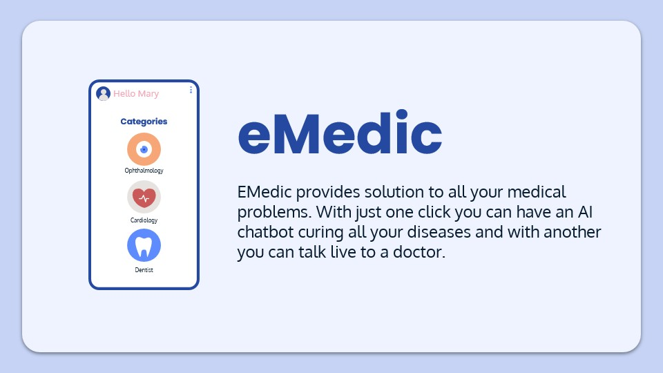
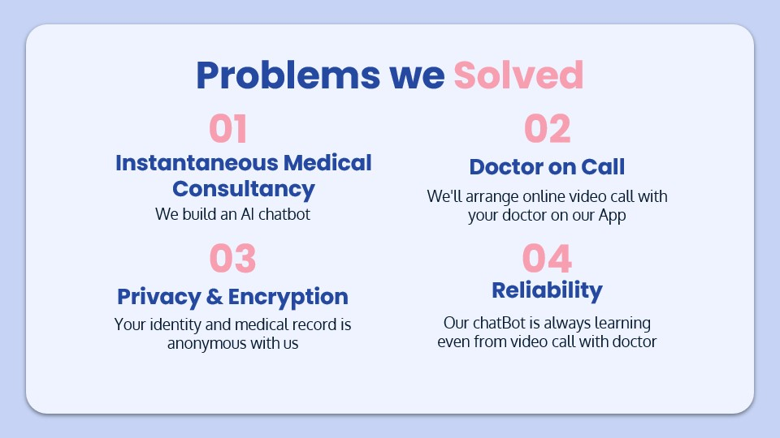
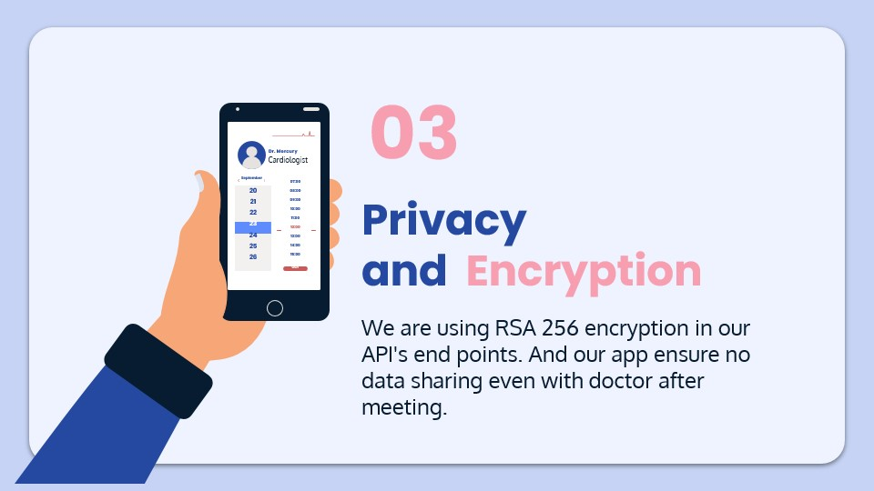
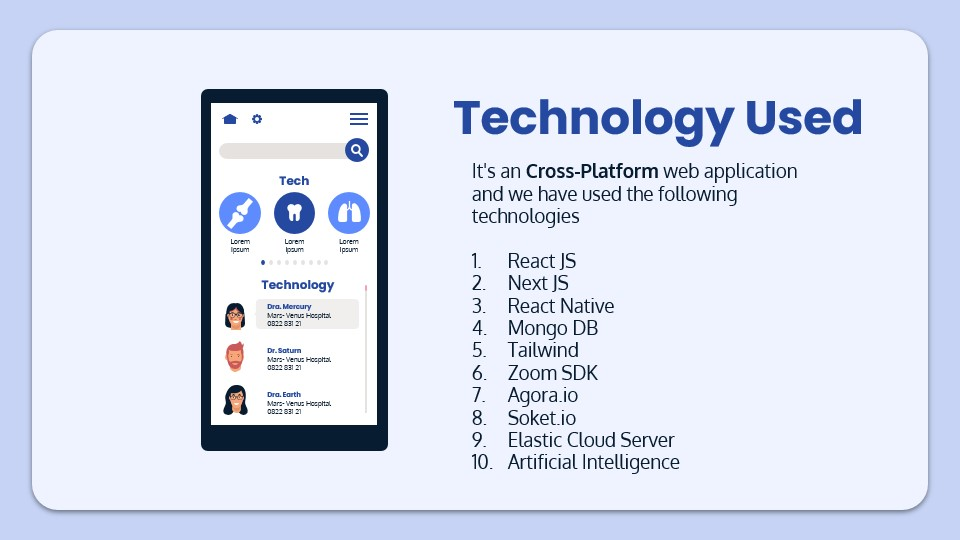
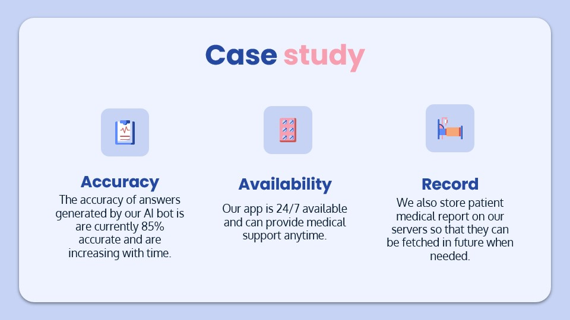

# 🚀 How to use

```sh
yarn
```

## 📝 Notes
```
This is simply a basic overview of what you can expect from our app.
We've used power point slides in order to make your experience better.
```
<h1>1. Remote Healthcare App </h1>










____
This is how our chatbot works
----


____

https://user-images.githubusercontent.com/95525120/229537854-8a3c5294-4ceb-436e-ab4e-ad683566b75d.mp4
# This is how it works
